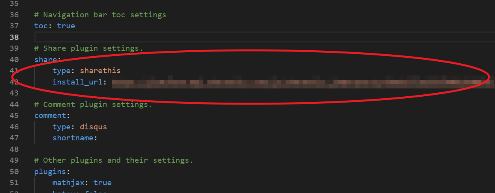

### 緣由

[上一篇](./2019-10-建置網站紀錄) 網誌建完之後只有基本的樣式
可能有額外需求要設定，固寫在此篇

### 備份

hexo-cli 只上傳轉換後的 html 檔
如需要備份 markdown 原始檔與專案設定檔可安裝 [hexo-git-backup](https://github.com/coneycode/hexo-git-backup)

(1) 安裝

```bash
$ npm i hexo-git-backup
```

(2) _config.yml 增加設定

```yml
backup:
    type: git
    repository:
        github: http://github.com/yourname/yourname.github.io.git,branchname
```

這裡的 "yourname" 改成你的 github 帳號
"branchname" 改成備份的 branch name

(3) 設定完就能下指令備份:

```bash
$ hexo b
```

### 加上文字計數

有些部落格有文章字數統計


我們可以安裝 [hexo-symbols-count-time](https://github.com/theme-next/hexo-symbols-count-time) 這個套件

(1) 安裝

```bash
$ npm i hexo-symbols-count-time
```

(2) _config.yml 增加設定

```yml
symbols_count_time:
    symbols: true
    time: true
    total_symbols: true
    total_time: true
    exclude_codeblock: false
    awl: 2
    wpm: 300
```

中文的話 "awl" 設為 2，"wpm" 設 300

### 分享功能

進入文章後預設底下會有 error 區塊


我們可以參考專案的 /themes/minos/_config.yml 檔案


minos 的分享預設是用 [sharethis](https://sharethis.com/)

(1) 註冊一個帳號

(2) 以 Domain 新增一筆 Property


(3) 選擇一個想使用的樣式，裡面可再做細項設定


(4) 設定好樣式後點選 "Get the Code"


(5) 複製 js code 的 "src" 的部分 (只要網址就好，不用整個 code)


(6) 網址複製到 /themes/minos/_config.yml 的 "share" 的 "install_url"


(7) 專案 deploy 後點選 "Verify Manually"


(8) 把線上站隨便一篇的網址複製過來進行檢測，檢測成功的話紅色區快會消失


(9) 設置成功的話網誌倒數第二塊會出現分享功能


### 留言功能

minos 的分享預設是用 [disqus](https://disqus.com/)

(1) 註冊一個帳號

(2) 新增一個 Site


(3) 新增完後點選 "general" 並複製 "Shortname" 欄位


(4) short name 貼到 /themes/minos/_config.yml 的 "comment" 的 "install_url"


(5) 設置成功的話網誌最下方會出現留言功能


### 追蹤

這邊是用 [Google Analytics](https://analytics.google.com/analytics/web/)

(1) Google 帳號登入

(2) 新增網站

(3) 追蹤碼貼到 /themes/minos/_config.yml 的 "Other plugins and their settings." 的 "google-analytics" 的  "tracking_id"


### 調整網站 Menu

Menu 是這個:


可到 /themes/minos/_config.yml 來做調整:


### 更換 DNS Server

Google Domains 的功能滿陽春的
因此換到 [CloudFlare](https://www.cloudflare.com/) 多了一些分析功能 (有些要付費)

(1) 註冊帳號

(2) 點選 "Add a Site"


(3) 填入 Blog 網址後點選 "Add site"


(4) 等待 CloudFlare 掃描
基本上 "電子郵件轉寄" 與大部分 "自訂資源記錄" 的設定都會完整複製過去
有缺少再補即可 (如 VPS 設定沒有複製過去)

(5) 複製 CloudFlare 提供的 DNS Server

(6) 回到 Google Domains -> DNS -> 名稱伺服器
選擇 "使用自訂名稱伺服器" 並填入剛複製的 DNS Server 網址


### 更新 Blog 後刪除 Cache

使用 CloudFlare 後，網站就會有了 Cache 功能
如果你更新網站想馬上看線上站的結果
可到 Caching -> Purge everything，點選 "purge everything"


