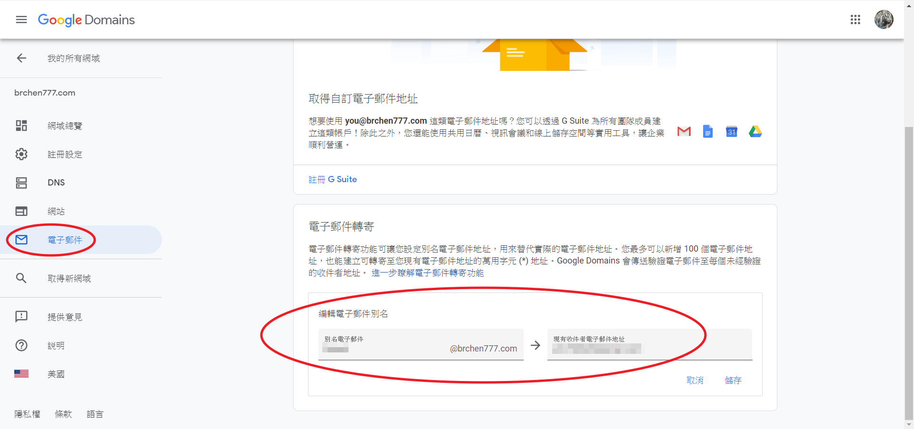
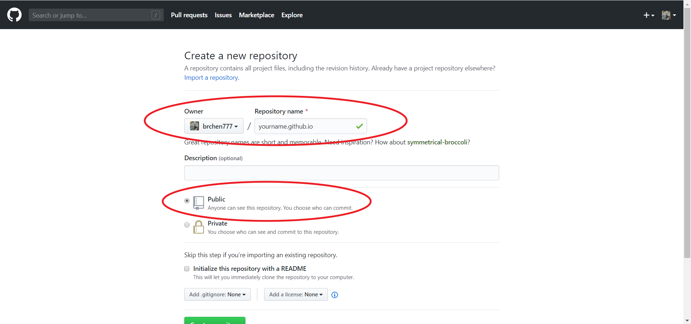
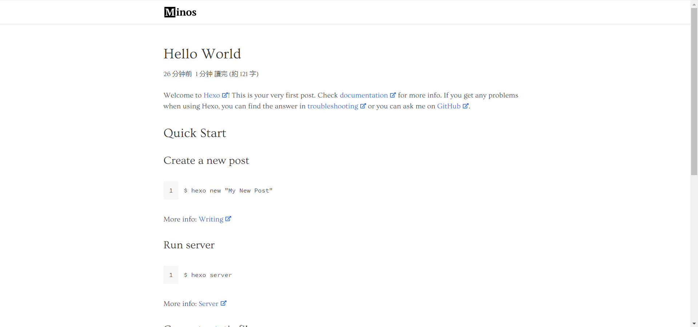
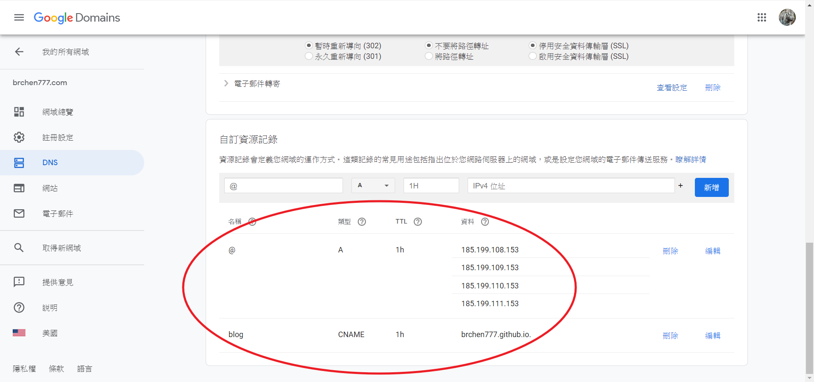
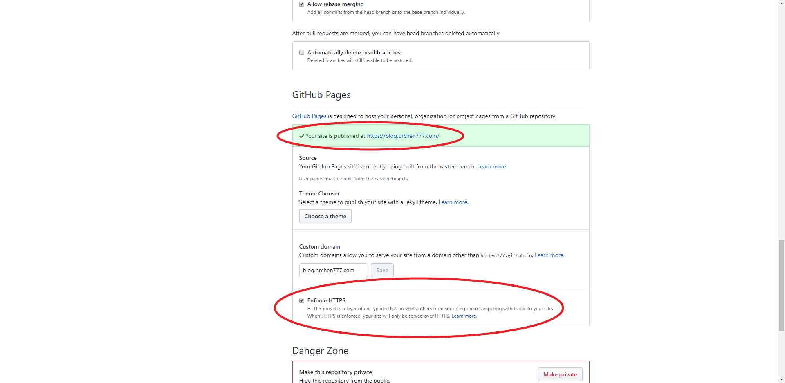
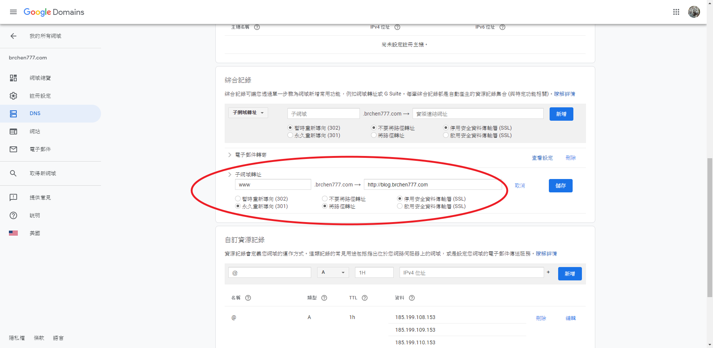

## 緣由

原本想要一個較個人風的 email
參照 [網路上](https://free.com.tw/improvmx/) 得知 Google Domains 不只提供 domain 同時提供指定 email 轉寄的功能
就直接照 [這篇](https://free.com.tw/google-domains/) 來購買一個 domain
Google 相較其他網域商，雖然價格貴一點點，但每年價格都很一致
不像有些強打第一年優惠但第二年以後價格快翻倍跳反而比 Google 的還貴
在這邊最便宜的一年 9 USD，商用字詞的約 1X USD 即可入手 (我是買 12 USD 的)

## 設定 Email 轉寄

1. 購買網域後，進入設定頁 -> 電子郵件

2. 最下方 "電子郵件轉寄" 填入你想要的別名與轉寄的地址，儲存後就會轉寄了
    

## 利用 Hexo 與 GitHub Page 建立免費的靜態 Blog

### 所需環境與工具

1. 一個 [GitHub](https://github.com/) 帳號

2. [NodeJS](https://nodejs.org/en/download/)

3. [Git](https://git-scm.com/downloads)

### 建立一個 Repository

1. 登入 GitHub

2. 建立 Repository

3. name 填入 `yourname.github.io` (yourname 請改成你的 GitHub ID)
    下方的 type 記得請勾選 "public"
    

### 安裝 Hexo

```bash
$ npm i hexo-cli -g
$ hexo init blog
$ cd blog
$ npm i
```

### 安裝 Hexo Git

```bash
$ npm i hexo-deployer-git
```

### 安裝 Blog 主題

這邊我們以安裝 [minos](https://github.com/ppoffice/hexo-theme-minos) 為例子
其中 minos 需要 [hexo-renderer-sass](https://www.npmjs.com/package/hexo-renderer-sass) 這個套件

```bash
$ git clone https://github.com/ppoffice/hexo-theme-minos.git themes/minos
$ npm i hexo-renderer-sass
```

### 調整設定

在 blog 資料夾內可以看到 "\_config.yml" 這個設定檔案
打開後在中下方有個 theme 的部分改成:

```yml
theme: minos
```

最下方 deploy 的部分則改成：

```yml
deploy:
    type: git
    repository: http://github.com/yourname/yourname.github.io.git
    branch: master
```

這裡的 "yourname" 改成你的 github 帳號
其他更詳細的設定可參考 [這裡](https://hexo.io/docs/configuration)

### 開啟 Server

```bash
$ hexo s -p [port]
```

預設在 [http://localhost:4000](http://localhost:4000) 看 Local Page (裡面會有一篇 Hello World)


### 建置靜態網頁

把 Markdown File 轉成網頁

```bash
$ hexo g
```

### 發佈到 GitHub Page 上

```bash
$ hexo d
```

或是你也可以建置、發佈一起做

```bash
$ hexo d -g
```

## 網站轉址

既然我們已經有 Google Domain 跟 Hexo + GitHub Page 產的 Blog，該是串起來的時候了

### 設定 DNS

到 Google Domains 設定頁 -> DNS -> 自訂資源紀錄
添加一筆 Type A，IP 如下：

-   185.199.108.153
-   185.199.109.153
-   185.199.110.153
-   185.199.111.153

再添加一筆 CNAME：
name 填 subdomain (例如 "blog")
data 填 `yourname.github.io` (yourname 請改成你的 github ID)

填完顯示如下：


### 設定 GitHub Page 的 Domain

1. 在 /blog/source 資料夾建立 CNAME 檔案

    ```bash
    $ cd /blog/source
    $ touch CNAME
    ```

2. 檔案內填寫入

    ```text
    subdomain.domain.com
    ```

    假設我的 subdomain 是 "blog"
    我買的 domain 是 `brchen777.com`
    那在這邊要填入的會是 `blog.brchen777.com`

3. 假設有填好，進入 GitHub Repository -> Settings -> GitHub Pages 區塊，會有 "Your site is published at XXX" 的訊息，其中 XXX 就是 blog 的網址，顯示如下：
    

4. GitHub Page 有內建 HTTPS，網站設定好一段時間之後就有 "Enforce HTTPS" 可選 (如上圖的下方)

### 設定多個 Subdomain 指向同一個 GitHub Page

因為 GitHub Page 不支援多個 CNAME 設定，所以其他的 subdomain 要自行設定轉址
到 Google Domains 設定頁 -> DNS -> 綜合記錄
假設要把 "www" 這個 subdomain 轉址，新增一筆子網域轉址如下：

以這篇案例來說，`www.brchen777.com` 與 `brchen777.github.io` 都會指到 `blog.brchen777.com`

### 參考資料

1. [在 Google Domains 註冊購買網域名稱教學](https://free.com.tw/google-domains/)
2. [Hexo+GitHub，新手也可以快速建立部落格](https://yaoandy107.github.io/hexo-tutorial/)
3. [如何搭建個人 Blog 使用 Hexo + Gitpage](https://medium.com/@bebebobohaha/%E4%BD%BF%E7%94%A8-hexo-gitpage-%E6%90%AD%E5%BB%BA%E5%80%8B%E4%BA%BA-blog-5c6ed52f23db)
4. [Hexo - 前端也能建置部落格！更換主題與發表文章篇](https://ithelp.ithome.com.tw/articles/10207997)
5. [Configuring a custom domain for your GitHub Pages site](https://help.github.com/en/articles/configuring-a-custom-domain-for-your-github-pages-site)
6. [自訂網域名稱：Google Domain](https://blog.haterain.app/custom-domain-by-google-domain/)
7. [Troubleshooting custom domains and GitHub Pages](https://help.github.com/en/articles/troubleshooting-custom-domains-and-github-pages)
