## 緣由

[上一篇](/2019/10/建置網站紀錄) 網誌建完之後只有基本的樣式
可能有額外需求要設定，固寫在此篇

## 備份

hexo-cli 只上傳轉換後的 html 檔
如需要備份 markdown 原始檔與專案設定檔可安裝 [hexo-git-backup](https://github.com/coneycode/hexo-git-backup)

1. 安裝

    ```bash
    $ npm i hexo-git-backup
    ```

2. _config.yml 增加設定：

    ```yml
    backup:
        type: git
        repository:
            github: http://github.com/yourname/yourname.github.io.git,branchname
    ```

    這裡的 "yourname" 改成你的 github 帳號
    "branchname" 改成備份的 branch name

3. 設定完就能下指令備份：

    ```bash
    $ hexo b
    ```

## 壓縮靜態網頁

這邊是用 [hexo-yam](https://github.com/curbengh/hexo-yam)
直接下指令安裝：

```bash
$ npm install hexo-yam
```

安裝完預設就會會啟動了，無須另外設定
如需特調細項可再去 _config.yml 做額外設定

## 分享功能

進入文章後預設底下會有 error 區塊
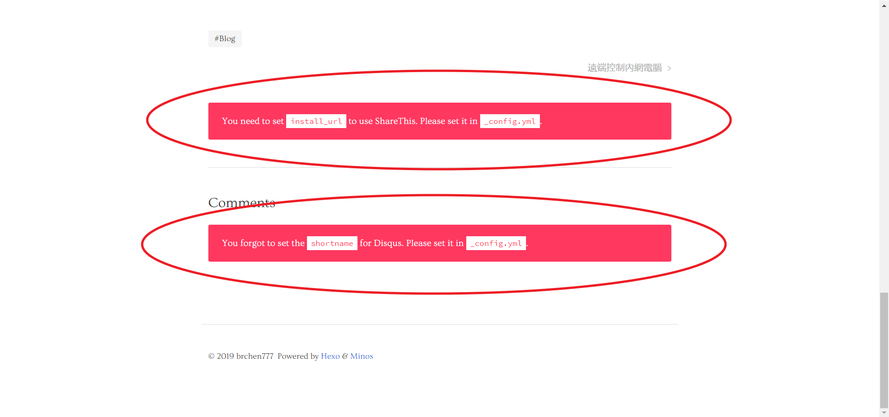

我們可以參考專案的 /themes/minos/_config.yml 檔案
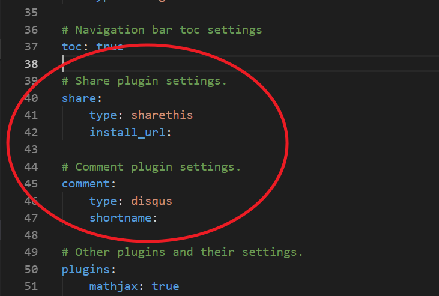

minos 的分享預設是用 [sharethis](https://sharethis.com/)

1. 註冊一個帳號

2. 以 Domain 新增一筆 Property
    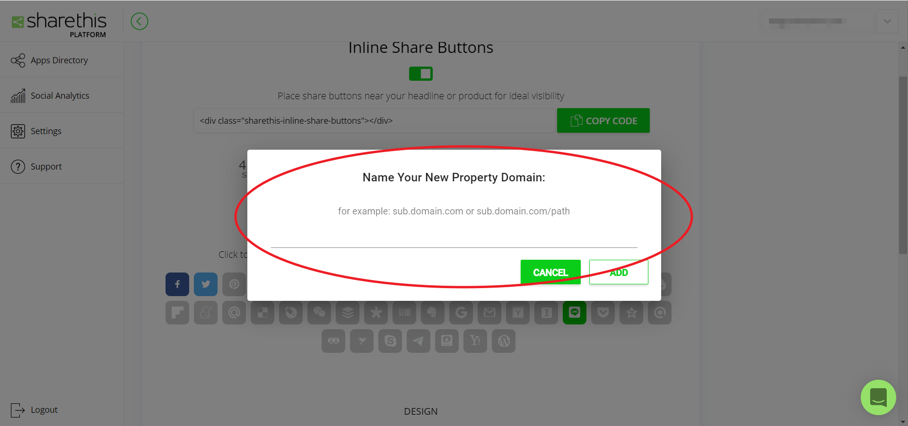

3. 選擇一個想使用的樣式，裡面可再做細項設定
    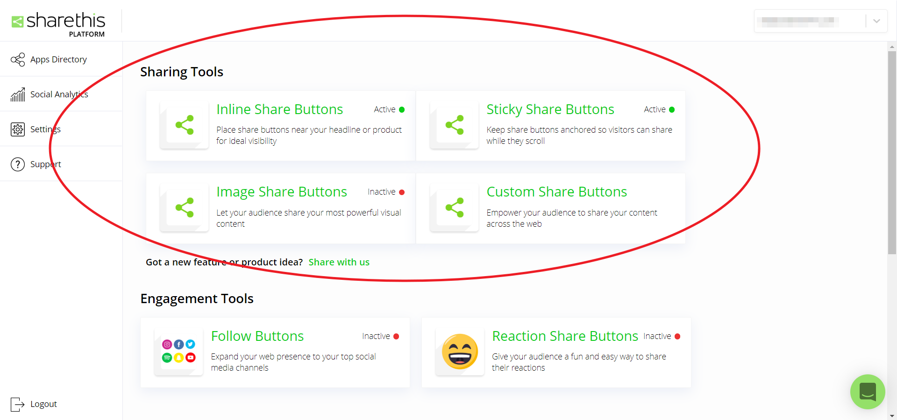

4. 設定好樣式後點選 "Get the Code"
    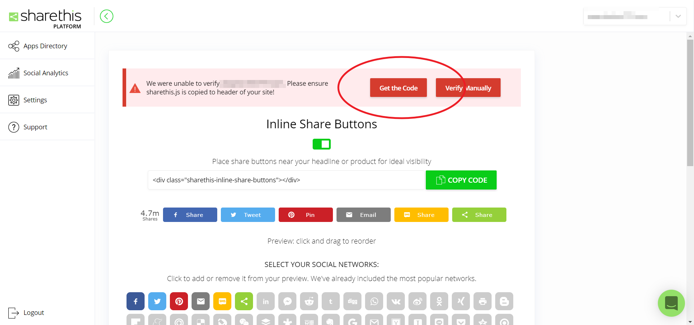

5. 複製 js code 的 "src" 的部分 (只要網址就好，不用整個 code)
    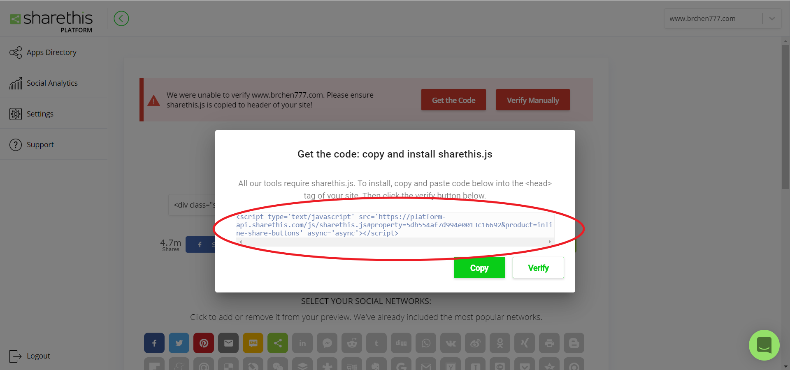

6. 網址複製到 /themes/minos/_config.yml 的 "share" 的 "install_url"
    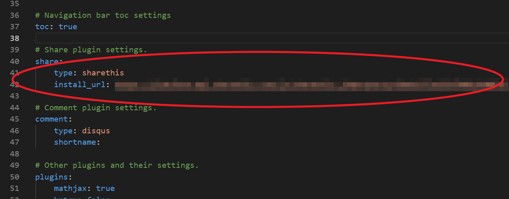

7. 專案 deploy 後點選 "Verify Manually"
    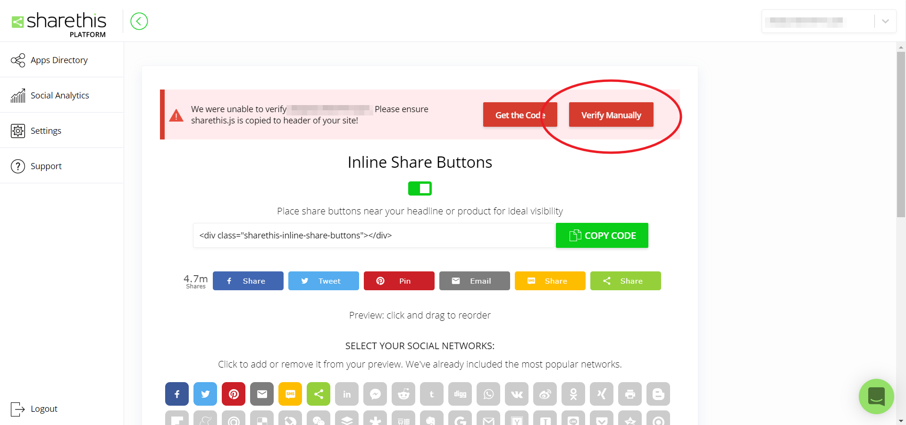

8. 把線上站隨便一篇的網址複製過來進行檢測，檢測成功的話紅色區快會消失
    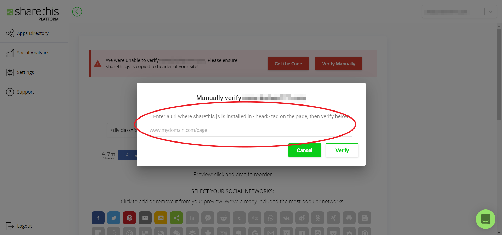

9.  設置成功的話網誌倒數第二塊會出現分享功能
    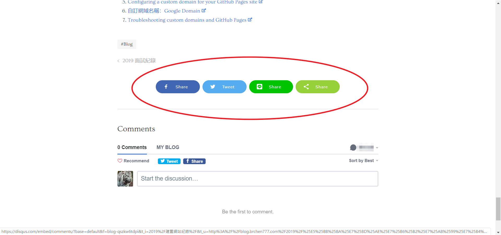

## 留言功能

minos 的分享預設是用 [disqus](https://disqus.com/)

1. 註冊一個帳號

2. 新增一個 Site
    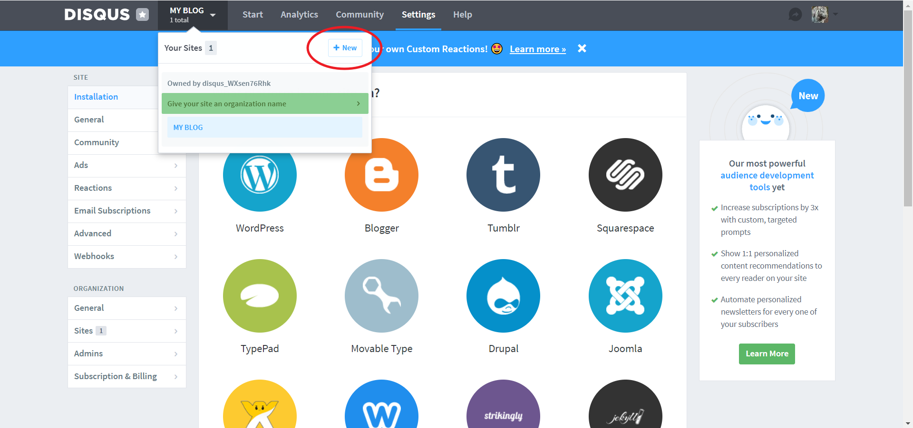

3. 新增完後點選 "general" 並複製 "Shortname" 欄位
    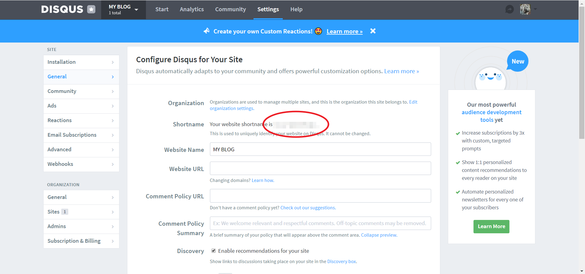

4. short name 貼到 /themes/minos/_config.yml 的 "comment" 的 "install_url"
    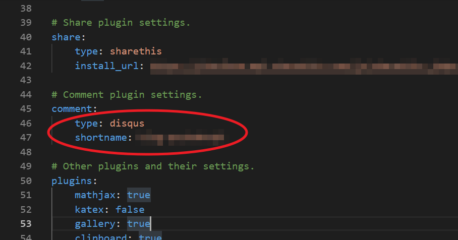

5. 設置成功的話網誌最下方會出現留言功能
    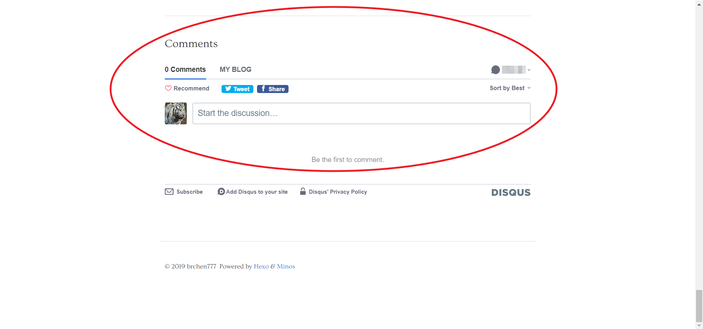

## 追蹤

這邊是用 [Google Analytics](https://analytics.google.com/analytics/web/)

1. Google 帳號登入

2. 新增網站

3. 追蹤碼貼到 /themes/minos/_config.yml 的 "Other plugins and their settings." 的 "google-analytics" 的  "tracking_id"
    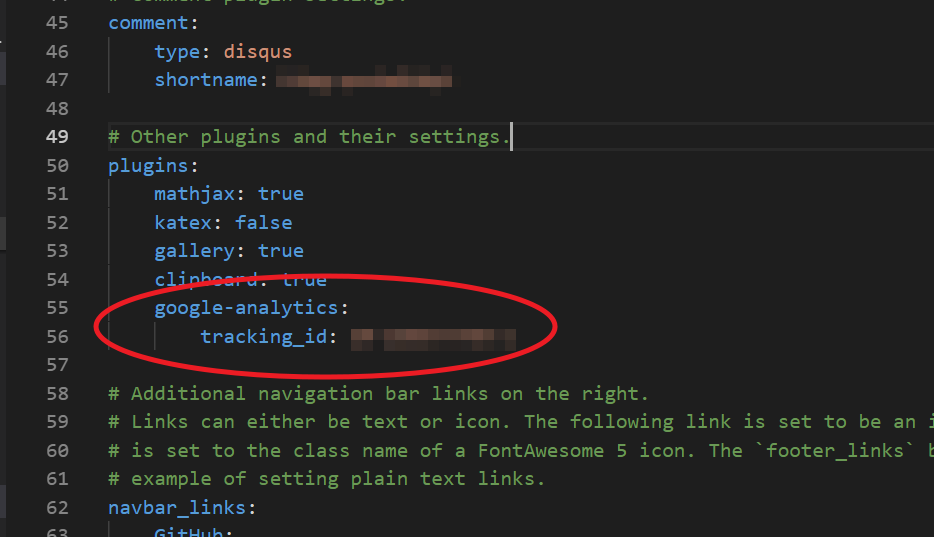

## 調整網站 Menu

Menu 是這個：


可到 /themes/minos/_config.yml 來做調整：
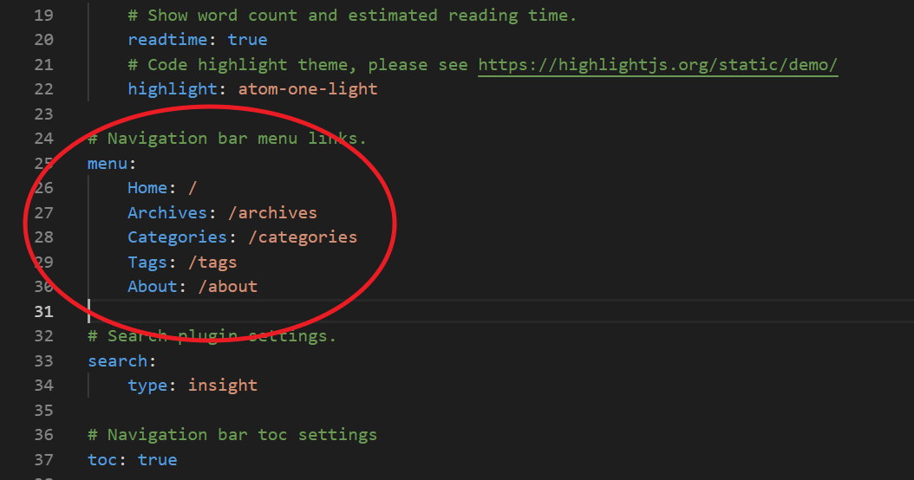

## 更換 DNS Server

Google Domains 的功能滿陽春的
因此換到 [CloudFlare](https://www.cloudflare.com/) 多了一些分析功能 (有些要付費)

1. 註冊帳號

2. 點選 "Add a Site"
    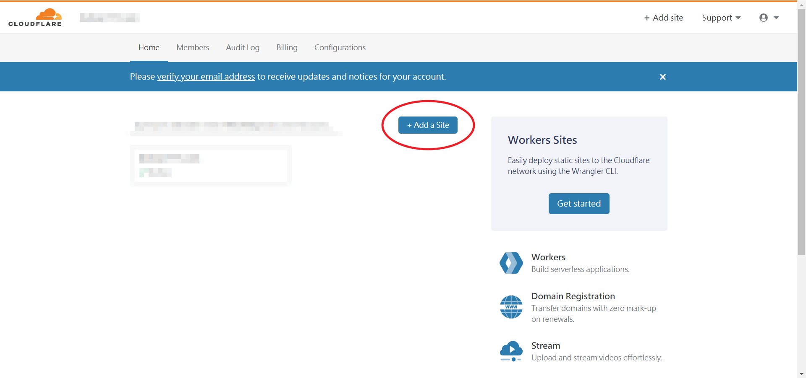

3. 填入 Blog 網址後點選 "Add site"
    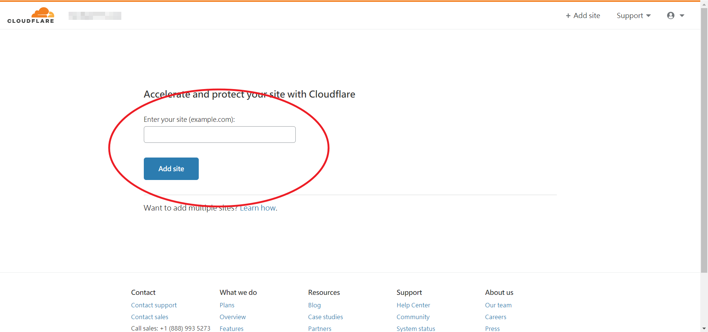

4. 等待 CloudFlare 掃描
    基本上 "電子郵件轉寄" 與大部分 "自訂資源記錄" 的設定都會完整複製過去
    有缺少再補即可 (如 VPS 設定沒有複製過去)

5. 複製 CloudFlare 提供的 DNS Server

6. 回到 Google Domains -> DNS -> 名稱伺服器
    選擇 "使用自訂名稱伺服器" 並填入剛複製的 DNS Server 網址
    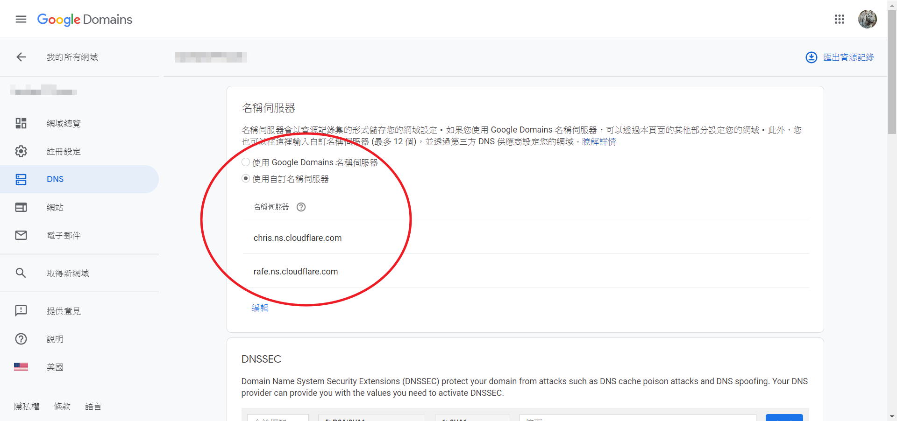

## 更新 Blog 後刪除 Cache

使用 CloudFlare 後，網站就會有了 Cache 功能
如果你更新網站想馬上看線上站的結果
可到 Caching -> Purge everything，點選 "purge everything"
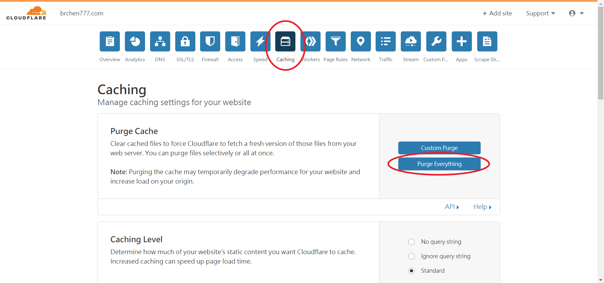

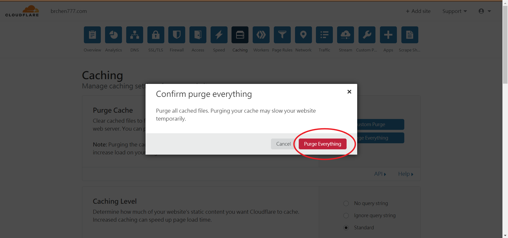
