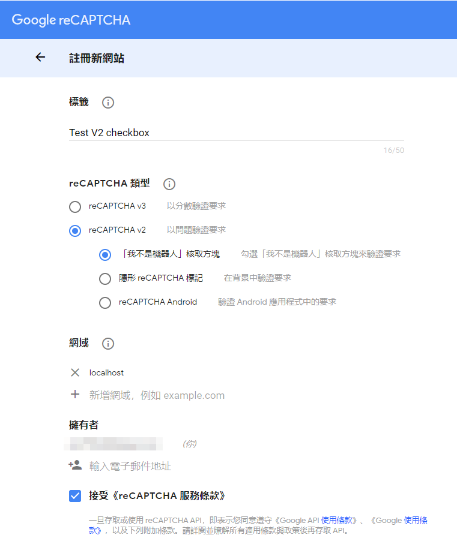
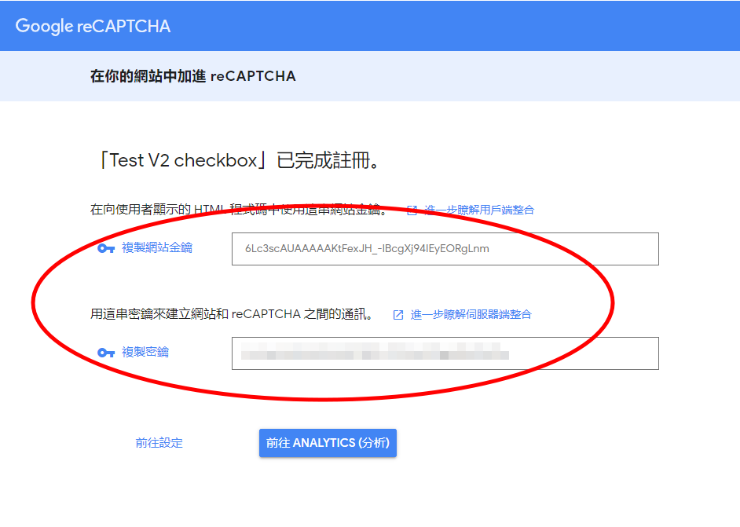
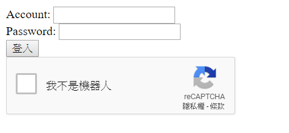

## 緣由

發文或登入時阻擋機器人 (bot)

## 版本

1. v3：分數驗證 (Google 會回覆 0~1 之間的分數)

2. v2：問題驗證 (要回答 Google 問的圖形之類的問題)
    (1) checkbox：勾選 "我不是機器人" 來驗證要求
    (2) invisible：藏在背景，有疑慮才需驗證

備註：[目前 ios 只支援 v2 invisible](https://github.com/fjcaetano/ReCaptcha#warning-%EF%B8%8F)

## 步驟

### 申請 reCaptcha key

這裡以 v2 checkbox 為例
先到 [這裏](https://www.google.com/recaptcha/admin/create) 申請
介面如下：


標籤填名稱
類型勾選 "v2" -> "我不是機器人核取方塊"
網域填寫網址或是 app 的 package name，如果是本地端測試也要填個 ```localhost``` 與 ```127.0.0.1```

### 複製 key

網站金鑰 (site key) 是前端用
密鑰 (secret) 則是後端用 (請保存好，小心外洩)


### 前端範例

以金鑰 = ```6Lc3scAUAAAAAKtFexJH_-IBcgXj94IEyEORgLnm``` 為例

#### client.html 範例

在這邊模擬一個登入畫面

1. 第 14 行；html 內放一個 hidden tag ```recaptcha-token``` 來存 token

2. 第 17 行；html 內放一個 div tag ```recaptcha``` 來放 checkbox

3. 第 19 ~ 20 行；底下再 load ```https://www.google.com/recaptcha/api.js``` 與 ```./recaptcha.js```

```html
<!DOCTYPE html>
<html lang="en">

<head>
    <title>reCAPTCHA V2 checkbox Test</title>
</head>

<body>
    <form id="myForm" action="http://localhost:7777/login" method="post">
        <label for="account">Account:</label>
        <input name="account" required><br />
        <label for="password">Password:</label>
        <input name="password" type="password" required><br />
        <input id="recaptcha-token" name="token" type="hidden" value="">
        <button>登入</button>
    </form>
    <div id="recaptcha"></div>
    <!--js-->
    <script src="https://www.google.com/recaptcha/api.js?onload=onloadCallback&render=explicit" async defer></script>
    <script src="./recaptcha.js"></script>
</body>

</html>
```

#### recaptcha.js 範例

1. 第 9 ~ 13 行；recaptcha 功能綁定到 ```recaptcha``` div 上

2. 第 16 ~ 18 行；render 的 callback 把拿到的 token 存回 ```recaptcha-token``` 內

3. 之後就能利用 form post 把 account、password、token 一起傳給後端

```javascript
const myForm = document.getElementById("myForm");
const recaptcha = document.querySelector("#recaptcha");
const recaptchaToken = document.querySelector("#recaptcha-token");

// v2 checkbox key
const siteKey = "6Lc3scAUAAAAAKtFexJH_-IBcgXj94IEyEORgLnm";

function onloadCallback() {
    window.grecaptcha.render(recaptcha, {
        sitekey: siteKey,
        size: "checkbox",
        callback: updateToken
    });
}

function updateToken(token) {
    recaptchaToken.value = token;
}
```

### Android 範例

請參考 [這裏](https://developer.android.com/training/safetynet/recaptcha.html)

### iOS 範例

請參考 [這裏](https://github.com/fjcaetano/ReCaptcha)

### 後端範例

這邊使用 [express](https://expressjs.com/) 來開一個後端 Server，[axios](https://github.com/axios/axios) 來發 request
要特別注意的是 [siteverify API](https://developers.google.com/recaptcha/docs/verify#api_request) 雖然 method 是 POST
但只能用 [querystring](https://nodejs.org/api/querystring.html) 來傳遞額外參數

1. 第 12 行；接收 token 等參數

2. 第 18 行；把 ```__your_secret__``` 替換成申請的密鑰

3. 第 15 ~ 21 行；把 secret、token 當參數 request siteverify API

4. 第 22 ~ 31 行；收到 siteverify API 的 Response，如果 success 是 true，代表驗證成功，第 24 行以後可作後續的 login 行為

```javascript
const axios = require("axios");
const express = require("express");
const bodyParser = require("body-parser");
const querystring = require("querystring");

const app = express();

app.use(bodyParser.urlencoded({ extended: false }));
app.use(bodyParser.json());

app.post("/login", async (req, res) => {
    const { account, password, token } = req.body;

    const { status, result } = await axios
        .post(
            "https://www.google.com/recaptcha/api/siteverify",
            querystring.stringify({
                secret: "__your_secret__",
                response: token
            })
        )
        .then(result => {
            const { success, "error-codes": errorCode } = result.data;
            if (success === true) {
                // login code...
                return { status: 200, result: { msg: "Success" } };
            } else {
                // verify error case
                return { status: 404, result: { errorCode } };
            }
        });
    res.status(status).json(result);
});

app.listen(7777);
```

### 成品畫面

如有設定成功的話會如以下畫面：

備註：如果 "我不是機器人" 區塊沒出來的話可去 [控制台](https://www.google.com/recaptcha/admin/site) 確認有沒有把網域加進去

### Error Code

如果 response 內的 success === false 時
```error-codes``` 會有錯誤訊息的 code
詳細可參考 [這裡](https://developers.google.com/recaptcha/docs/verify#error_code_reference)

## 資料來源

1. [Developer's Guide](https://developers.google.com/recaptcha/intro)
2. [reCAPTCHA v2 Invisible，不用再把「我不是機器人」列入頁面設計考量](https://medium.com/@z3388638/recaptcha-v2-invisible-%E4%B8%8D%E7%94%A8%E5%86%8D%E6%8A%8A-%E6%88%91%E4%B8%8D%E6%98%AF%E6%A9%9F%E5%99%A8%E4%BA%BA-%E5%88%97%E5%85%A5%E9%A0%81%E9%9D%A2%E8%A8%AD%E8%A8%88%E8%80%83%E9%87%8F-2b83dbce03cb)
3. [reCaptcha Form with an Amazon AWS™ serverless backend environment](https://medium.com/aws-factory/recaptcha-form-with-an-amazon-aws-serverless-backend-environment-809cdb788424)
4. [How to Setup a Serverless Contact Form with AWS Lambda, reCAPTCHA and Storyblok](https://www.storyblok.com/tp/serverless-contact-form-setup)
5. [簡介:給人類方便給bot困難](https://easonwang01.gitbooks.io/web_advance/google_speech_api/google-recaptcha.html)
6. [如何整合“No CAPTCHA reCAPTCHA”（驗證碼）到你的網站裡](https://webdesign.tutsplus.com/zh-hant/tutorials/how-to-integrate-no-captcha-recaptcha-in-your-website--cms-23024)
