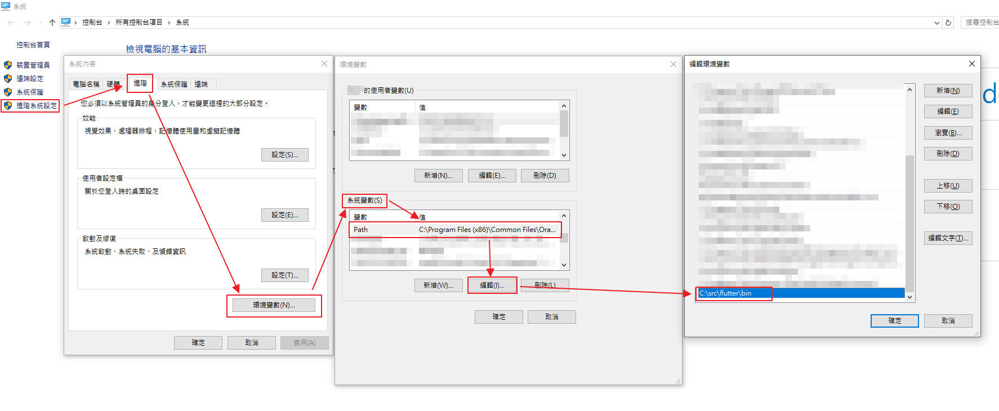
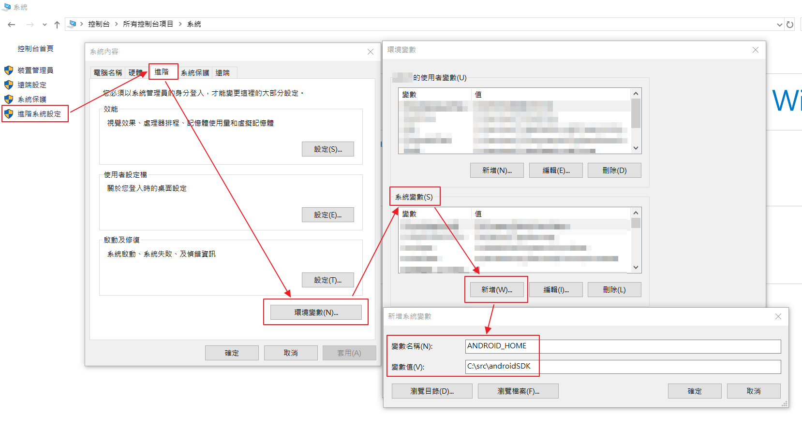
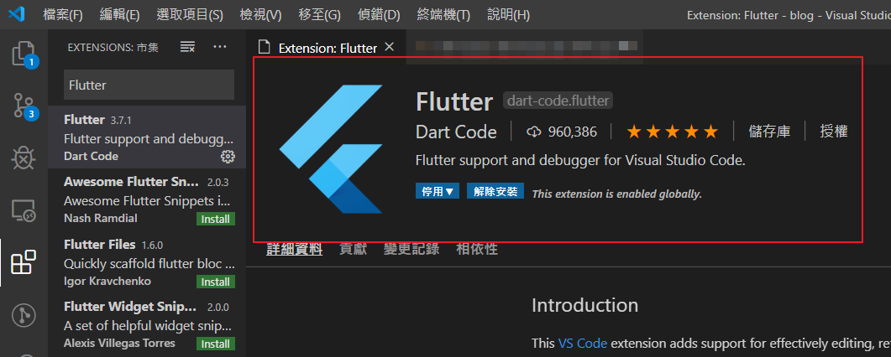
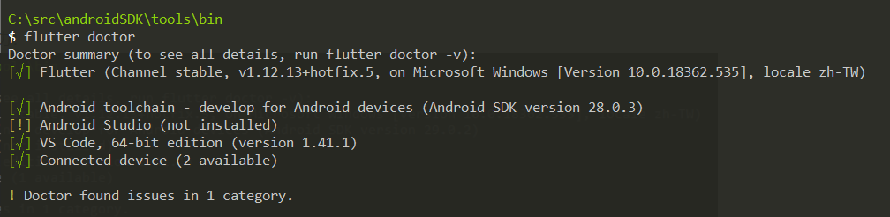

## 所需環境與工具

以下以 Windows 10 + VSCode 為例：

### 安裝 Flutter SDK

1. 到 [這裡](https://flutter.dev/docs/get-started/install/windows) 有安裝說明

2. [這裡](https://storage.googleapis.com/flutter_infra/releases/stable/windows/flutter_windows_v1.12.13+hotfix.5-stable.zip) 可下載最新版 (v1.12.13 + hotfix5 版本)

3. 安裝後壓縮檔解壓縮並把 **flutter** 資料夾放到想要的位置  
   (官方建議**不要**把 **flutter** 資料夾放到 ```C:\Program Files\``` 內)

4. 設定環境變數  
假如資料夾路徑為 ```C:\src\flutter```  
本機 -> 右鍵 -> 內容 -> 進階系統設定 -> 進階 -> 環境變數 -> 系統變數 -> 編輯 -> 把 ```C:\src\flutter\bin``` 加上去


### 安裝 Java SDK

1. 到 [這裡](https://www.oracle.com/technetwork/java/javase/downloads/jdk8-downloads-2133151.html) 可下載 JAVA 8  
備註：請不要裝更新的版本，不然 Android SDK 會不支援

### 安裝 Android SDK Manager

1. 到 [這裡](https://developer.android.com/studio/#command-tools) 下載 Command Command line tools

2. 解壓縮資料夾並把 **tools** 資料夾放到想要的位置
(在這裡以放到 ```C:\src\androidSDK``` 內為範例)

### 安裝 Android SDK

1. 進到 **tools\bin** 內開啟 cmd

2. 列表出可安裝清單

    ```bash
    $ sdkmanager --list
    ```

3. 安裝 **platform-tools**、**platforms**、**build-tools**  
以下以 28 版當例子：

    ```bash
    $ sdkmanager "platform-tools" "platforms;android-28" "build-tools;28.0.3"
    ```

4. 加上環境變數 ANDROID_HOME
假如資料夾路徑為 ```C:\src\androidSDK```
本機 -> 右鍵 -> 內容 -> 進階系統設定 -> 進階 -> 環境變數 -> 系統變數 -> 新增 -> 把 ```C:\src\androidSDK``` 加上去


### 安裝 Flutter 套件

1. 開啟 VSCode

2. 安裝 Flutter Plugin


### 檢測環境

1. cmd 下指令接受 license

    ```bash
    $ flutter doctor --android-licenses
    ```

2. 把 Android 手機接上電腦或使用模擬器

3. 檢測環境

    ```bash
    $ flutter doctor
    ```

出現以下畫面就算成功：



## 資料來源

1. [No valid Android SDK platforms found in C:\Android\android-sdk\platforms. Directory was empty.](https://github.com/flutter/flutter/issues/25397#issuecomment-483945640)
