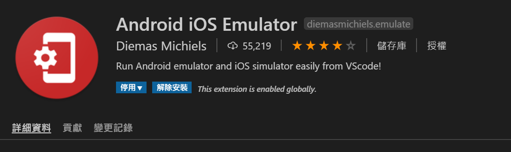
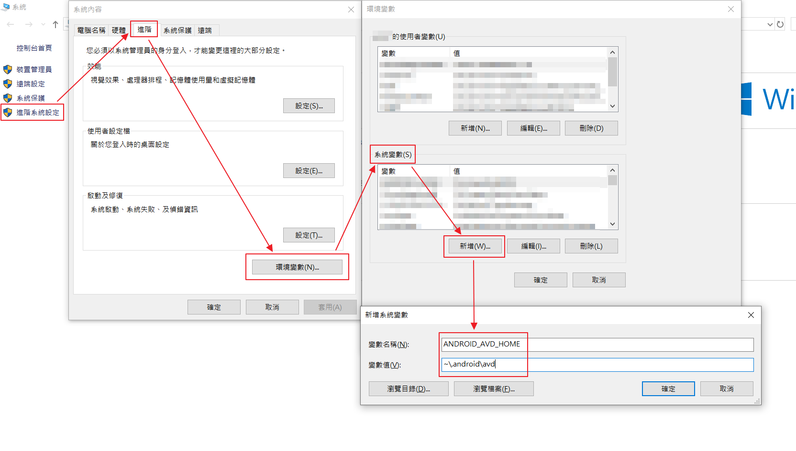
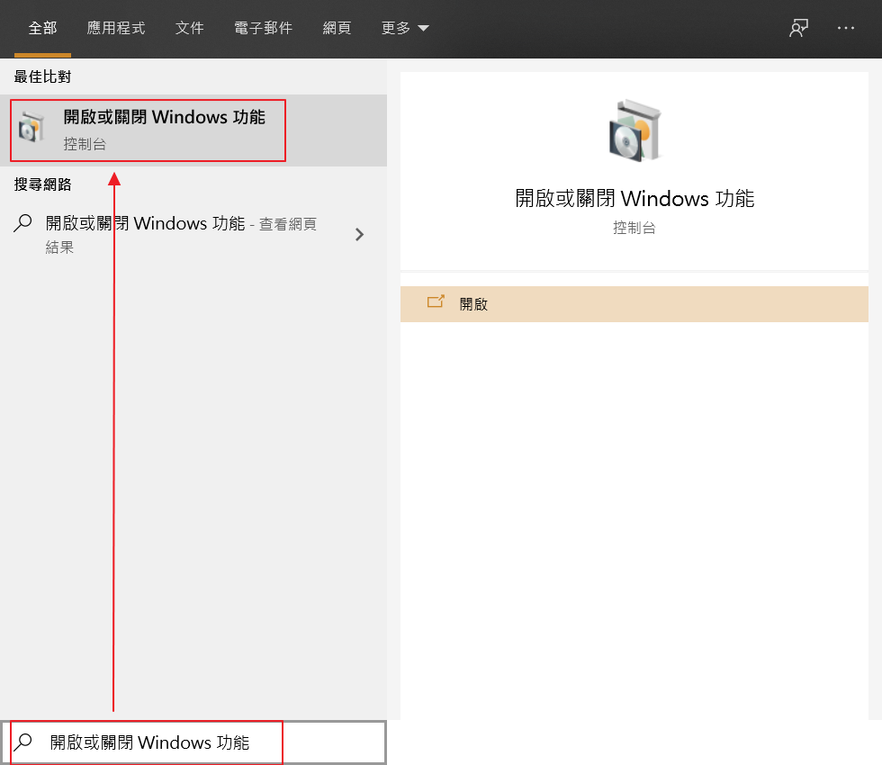
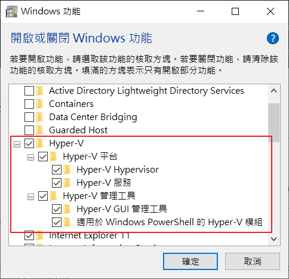
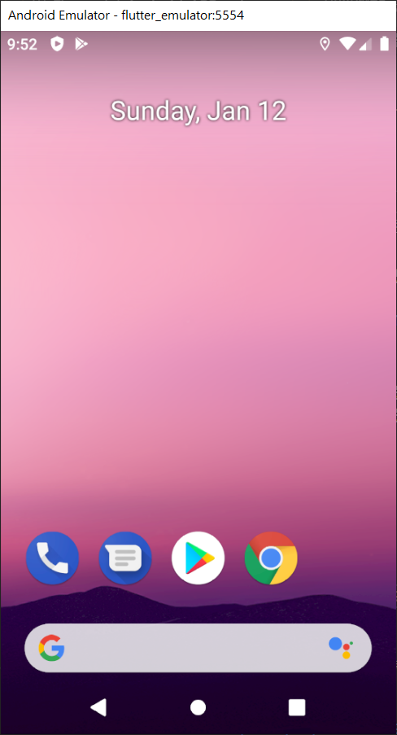
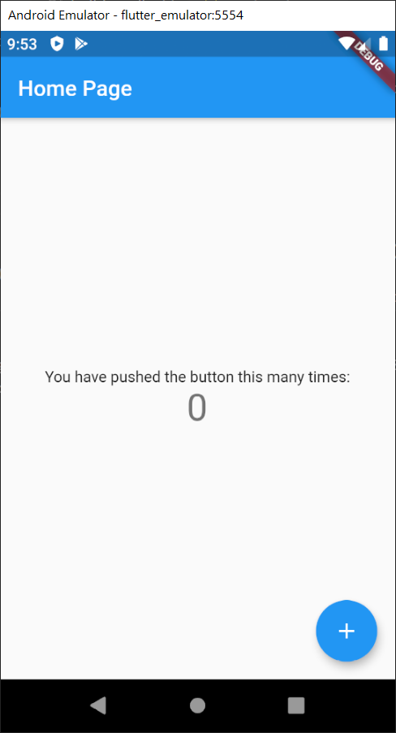

## 前言

延續 [上一篇](/2019/12/用-Flutter-寫-Android-APP) 假如不使用實體手機，那勢必要建立一個模擬器

## 所需環境與工具

以下以 Windows 10 + VSCode + 模擬器為 Android 為例：

### 安裝 Android iOS Emulator 套件

1. 開啟 VSCode

2. 安裝 Android iOS Emulator


### 安裝 Emulator 與相關的套件

1. 進到 **tools\bin** 內開啟 cmd

2. 列表出可安裝清單

    ```bash
    $ sdkmanager --list
    ```

3. 安裝 **emulator**、**Intel x86 Emulator Accelerator** (Intel 平台)

    ```bash
    $ sdkmanager --install "emulator" "extras;intel;Hardware_Accelerated_Execution_Manager"
    ```

4. 安裝 **avd image**
以下以 28 版當例子：

    ```bash
    $ sdkmanager --install "system-images;android-28;google_apis_playstore;x86_64"
    ```

5. 加上環境變數 ANDROID_AVD_HOME
假如資料夾路徑為 ```~\.android\avd```
本機 -> 右鍵 -> 內容 -> 進階系統設定 -> 進階 -> 環境變數 -> 系統變數 -> 新增 -> 把 ```~\.android\avd``` 加上去


### 開啟 Hyper-V 與 HAXM (Intel 平台)

1. 搜尋 -> 輸入 "開啟或關閉 Windows 功能" -> 對 "Hyper-V" 打勾 -> 按 "確定"



1. 重開機

### 開啟模擬器

假設已經有專案了

1. 在 VSCode 內 -> 按下 ```Ctrl + Shift P``` -> 輸入 "Flutter: Launch Emulator" -> 選擇 "Create Android emulator"

2. 等待一很長一段時間完會出現一個模擬器


3. 就能利用此模擬器來 Debug 了


## 資料來源

1. [用 VS Code 建置 Flutter 開發環境](https://jonny-huang.github.io/flutter/flutter_001/)
2. [硬體加速以提升模擬器效能 (Hyper-V 與 HAXM)](https://docs.microsoft.com/zh-tw/xamarin/android/get-started/installation/android-emulator/hardware-acceleration?pivots=windows)
3. [How to set up devices for VS Code for a Flutter emulator](https://stackoverflow.com/questions/49280884/how-to-set-up-devices-for-vs-code-for-a-flutter-emulator)
4. [avdmanager](https://developer.android.com/studio/command-line/avdmanager)
